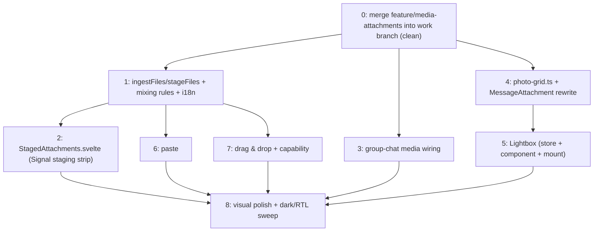

# Signal-parity polish for Dash Chat image & file attachments

## Context

Michael's `origin/feature/media-attachments` branch gives Dash Chat a working backend + basic UI for photo and file messages. Verified directly against the branch in this session: Rust `Media` enum (photos[] XOR single file), CBOR wire format with compat versioning, 16 MiB cap enforced in `ui/src/lib/types/media.ts` + mailbox-server, compression before send, send/receive rendering in `MessageFromMe`/`MessageFromOthers` (shared by direct and group chats), redaction patterns updated, e2e happy paths in `e2e-tests/specs/media-attachments.spec.ts` with attach helpers in `e2e-tests/helpers/pages/direct-chats/direct-chat-page.ts`.

Eric wants the front end polished to match Signal's image+file UX — every flow, step, and detail. Voice notes, video playback, media editor, GIF pipeline, forwarding, "All media" gallery, and view-once are out of scope (deferred).

**Branch state (verified):** `feature/media-attachments` is 5 commits ahead and 88 commits behind `develop`. `git merge-tree --write-tree origin/develop origin/feature/media-attachments` produces a clean tree — **no conflicts**. Work happens on `claude/refine-local-plan-q7h8no` (currently at develop head): step 0 merges the feature branch in.

### Signal flow map → Dash Chat parity scorecard (verified against branch code)

| Flow | Signal behavior | Dash Chat today (on the branch) | Action |
|---|---|---|---|
| Attach entry | Media + file buttons; mixing rules; 32-item cap | '+' menu works, but `onPhotosPicked`/`onFilePicked` **replace** the draft; no cap | Append semantics, cap 32, mixing-rule toasts |
| Mixing rules | Photos+videos together; never with files; one file max | Enforced by data model only (replace hides it) | Toast on violation with Signal's exact strings |
| Drag & drop | Drop onto conversation, overlay | None | Add (Tauri drag-drop event + HTML5 fallback) |
| Paste | Clipboard image → staged | None | Add via textarea paste event |
| Staging strip | 120×120 thumbs r4 gap-8px, 16px X, add-another tile, 120×120 file card with extension sheet, clear-all header when >1 | 72px thumbs in `.photo-row`, generic `.file-pill` | Rebuild to Signal specs (`StagedAttachments.svelte`) |
| Caption | Text + media = one message | Works (`{message, media}` in one send) | Keep |
| Send states | Spinner → ticks | `MessageStatusIndicator` (sending/local/cloud) | Keep |
| Receive states | Blurhash, tap-to-download | N/A — bytes arrive inline (p2p) | Nothing to build |
| Bubble: 1 photo | w∈[200,300], h=w×aspect clamped [50,450], cover-crop, hairline border, plate behind transparency | natural aspect, `max-height: 320px`, `min-width: 240px` | Rebuild to Signal math |
| Bubble: N photos | 1px gaps; 2→300×150, 3→300×200 (one 200² + two 100²), 4→2×2 of 150², 5+→300×250, +N scrim after 5 | square cells, 2px gap, `MAX_PHOTO_CELLS = 4`, +N after 4 | Rebuild to Signal layouts |
| Bubble: file | Whole-row button, 36×40 icon w/ extension sheet, 14px/500 name, 12px size, no trailing icon | Similar pill but `mdiFile` 28px + trailing download icon | Restyle |
| Photo click | Lightbox | Nothing (cells are plain `
`s) | Build Lightbox (biggest new piece) |
| File click | Save dialog, "File saved" toast | Works (`saveFile` in MessageAttachment; `dialog:allow-save` + `fs:allow-write-file` already in `desktop.json`) | Keep |
| Group chat send | Same composer | `media: null` hardcoded in `group-chat/[chatId]/+page.svelte` `sendMessage()`; **`GroupChatStore.sendMessage` already accepts `{message, media}`** and bubbles already render media | Wire the page only |
| Chat-list preview | "Photo" / filename | `summarizeMessageContent` in `packages/stores/src/types.ts`: "📷 Photo" / "📎 name" | Align wording (drop emoji, match Signal: "Photo", "N photos", filename) |
| Errors | Size/type/cap toasts | Size toast only (`errorAttachmentTooLarge`) | Add cap + mixing toasts |

### Signal reference constants (inlined — the local reference file from the draft is not available in this session)

- **Single image:** render width clamped to [200, 300]px; height = width × (h/w) clamped to [50, 450]px; `object-fit: cover`; 1px inset hairline border overlay; white (light) / black (dark) plate behind transparent PNGs.
- **Grids:** gap 1px. 2 photos → 300×150 (two 150×150… i.e. `aspect-ratio: 2/1`, 1×2 columns); 3 → 300×200 (`3/2`: one 200×200 + column of two 100×100); 4 → 2×2 of 150² (`1/1`); 5+ → 300×250 (`6/5`: two 150² top row, three 100² bottom row), `+N` scrim (black/50, white 24px) on the 5th cell.
- **Staging strip:** rail max-height ~142px; 120×120 thumbs, radius 4, gap 8px; 16px white X button at top-end inset 4px with top gradient on hover; dashed "add another" 120px tile with 28px plus; 120×120 file card with 30×40 extension sheet + 11px two-line filename; "clear all" row when >1 staged.
- **File row in bubble:** whole row is the button; 30×40 extension sheet (uppercase extension label) in a 36×40 container, `me-3`; filename 14px/500 single-line ellipsis; size 12px below at 70% opacity.
- **Lightbox:** full-black overlay; 52px header (sender 13px bold white, timestamp 11px gray, save + close 24px buttons, gap 8); stage `object-fit: contain`; prev/next arrow buttons + ArrowLeft/Right; Esc / X / stage-click close; 44×44 radius-6 filmstrip thumbs with 2px white ring on selected when >1 photo; double-click 3× zoom with mousemove pan via `transform-origin`, header/filmstrip fade while zoomed, Esc exits zoom first; focus returns to the triggering element on close.
- **Error strings (Signal's):** "You cannot add any more attachments to this message." / "You can't select photos and videos along with files." / "You can only select one file at a time."

Signal screenshots: the CLAUDE.md `gh repo clone` setup doesn't work here (no `gh`). Use the claude-code-remote MCP `add_repo` tool to add `dash-chat/signal-screenshots` to the session scope and read `manifest.json` + relevant `direct-chat/`, `message-types/` screenshots via GitHub MCP `get_file_contents`. If the repo can't be added, proceed with the constants above.

## Design

### New files

- `ui/src/lib/components/messages/photo-grid.ts` — pure helpers: `getTimelineImageDimensions(w, h)` (Signal clamps above) and `gridConfig(count)` → `{visibleCells: min(count, 5), aspectRatio}` (2→`2/1`, 3→`3/2`, 4→`1/1`, 5+→`6/5`). Unit-testable, no DOM.
- `ui/src/lib/stores/lightbox.svelte.ts` — runes module store (same pattern as `ui/src/lib/stores/screen.svelte.ts`): `open({photos, index, senderName, timestamp}, triggerEl)`, `close()` (restores focus to `triggerEl`), `next()/prev()/select(i)`. Callable directly from `MessageAttachment`, no prop drilling.
- `ui/src/lib/components/messages/Lightbox.svelte` — single global instance mounted in `ui/src/routes/+layout.svelte` just before `<ToastManager />` (line ~212). Custom overlay `fixed inset-0 z-30 bg-black` — above the composer's attach scrim/menu (z-10/z-20 in `MessageInput.svelte`), below Konsta toasts. NOT a Konsta Sheet/Dialog (wrong chrome for an immersive viewer). Behavior per the lightbox constants above. Owns its blob URLs (`$derived.by` building URLs from `photos[].data` via `bytesToBlobUrl`, `$effect` cleanup revokes) — does not reuse the bubble's URLs. Save button reuses the same Tauri save-dialog logic as `saveFile` — extract that into `ui/src/lib/utils/save-file.ts` and call it from both `MessageAttachment` and `Lightbox`.
- `ui/src/lib/components/StagedAttachments.svelte` — Signal staging strip extracted from `MessageInput.svelte` (replaces `.media-preview`/`.photo-row`/`.file-pill` markup): per staging constants above; remove buttons get `data-testid="message-input-remove-attachment-{i}"`; "add another" tile (visible when photos staged < 32) triggers the photo picker; clear-all header row when >1 staged. Keep `data-testid="message-input-media-preview"` on the root so existing e2e helpers keep working.
- `ui/src/lib/components/MediaDropOverlay.svelte` — drop overlay + both drop pipelines, mounted in both chat pages; single `onFiles(files: File[])` callback into `stageFiles`.
- e2e: `e2e-tests/helpers/components/composer.ts` (attach/stage/send helpers extracted from `direct-chat-page.ts` so `group-chat-page.ts` can reuse them — same component-object pattern as `helpers/components/connection-status-indicator.ts`), `e2e-tests/helpers/components/lightbox.ts`, specs `media-lightbox.spec.ts`, `groups/group-media.spec.ts`.

### Core behavior change — draft ingestion with Signal mixing rules

In `ui/src/lib/types/media.ts`: `ingestFiles(current: DraftMedia | undefined, files: File[]) → {media: DraftMedia | undefined, error?: 'tooMany' | 'filesWithPhotos' | 'oneFileAtATime'}` plus a `stageFiles()` wrapper in the composer that toasts on error. Rules:

- photos **append** to an existing photo draft (today `onPhotosPicked` revokes and replaces) up to `MAX_STAGED_PHOTOS = 32`;
- file already staged + anything new → `errorOneFileAtATime`;
- photos staged + non-image file → `errorFilesWithPhotos`;
- over cap → `errorTooManyAttachments` with partial accept (stage up to the cap, toast).

Pickers, paste, and drag-drop all route through it. Existing draft items keep their object URLs (no revoke-recreate). `draftToMedia`, the 16 MiB cap, `AttachmentTooLargeError` handling, and caption-in-same-message stay untouched.

### MessageAttachment rewrite

Keep the edge-to-edge negative-margin technique + `border-radius: inherit` + `overflow: hidden`; drop `min-width: 240px`. Envelope: `width: 300px; max-width: calc(100% + 2 * var(--bubble-padding, 0.5rem)); aspect-ratio: <from gridConfig>` so narrow bubbles shrink proportionally. Grid per the constants; render first 5 cells; `+{count-5}` scrim on cell 5 (replaces today's `MAX_PHOTO_CELLS = 4` / `.photo-overlay`). Single image: dimensions from `naturalWidth/naturalHeight` on load (fallback 200×50 until decode — bytes are local, decode is instant). Corner rules: `withContentBelow` (caption text or isLast row below) → `border-end-start-radius/border-end-end-radius: 0`; `withContentAbove` (group sender-name header) → start radii 0. Both booleans are computed inside `MessageFromMe`/`MessageFromOthers` (they already know about caption/sender-name) and passed as props — no page changes. Every photo cell becomes a `<button>` → `lightbox.open(...)`; `MessageFromMe` passes `senderName: m.you()`, `MessageFromOthers` passes the sender profile name; both pass `message.timestamp`. File row restyled per constants (keep `saveFile` logic + `message-attachment-file` testid; drop the trailing `mdiDownload` icon; extension sheet derives its label from the filename extension).

### Group chat wiring

`ui/src/routes/group-chat/[chatId]/+page.svelte`: copy the direct-chat pattern — `messageMedia: DraftMedia | undefined` state, `media`/`onMediaChange` props on `MessageInput`, `draftToMedia` in `sendMessage` with draft kept on `AttachmentTooLargeError` and text restored on other errors; mount `MediaDropOverlay`. `GroupChatStore.sendMessage` already accepts `{message, media}` — only the hardcoded `media: null` changes. Rendering already works (shared bubble components).

### Drag-drop + paste

- HTML5 `dragenter/dragover/dragleave/drop` with an enter-counter; guard `if (isTauriEnv() && e.isTrusted) return` so native drops aren't double-handled (Tauri intercepts them when `dragDropEnabled` is default-true, which it is — no `dragDrop` key in `tauri.conf.json`).
- Tauri path: `getCurrentWebview().onDragDropEvent` → paths → `readFile` from `@tauri-apps/plugin-fs` (already a ui dependency) → `File` objects with an extension→mime map for common types. Requires adding `fs:allow-read-file` + a broad `fs:scope` to `src-tauri/capabilities/desktop.json` — **flag in the PR for security review**; the documented alternative is a dedicated Rust command that reads the dropped path.
- Paste: `onpaste` on the composer textarea → `event.clipboardData.files` → `stageFiles`.
- Overlay UI: `bg-black/40` + dashed card "Drop files here to send them".

### i18n (en.json only)

New keys with Signal's exact strings: `errorTooManyAttachments`, `errorFilesWithPhotos`, `errorOneFileAtATime` (strings above), plus `addMoreAttachments`, `removeAllAttachments`, `dropFilesToSend`, `you`, `previousPhoto`, `nextPhoto`, `closeLightbox`. Reuse existing `saveFile` / `fileSaved` / `removeAttachment`. Update `summarizeMessageContent` to Signal wording ("Photo" / "N photos" / filename, no emoji) — it lives in `packages/stores/src/types.ts`, plain string returns (the stores package has no i18n; same as today).

## Sequencing (each step independently verifiable, committed separately)

0. **Merge** `origin/feature/media-attachments` into `claude/refine-local-plan-q7h8no` (verified conflict-free). Baseline: `pnpm check` (ui/), `pnpm build` (packages/stores), `cargo nextest run` if Rust files moved, run `media-attachments.spec.ts`.
1. Ingestion module + append/mixing/cap rules + i18n keys + `MessageInput` picker rewiring; extend `media-attachments.spec.ts` (append, mixing toasts, 32-cap).
2. Staging strip (`StagedAttachments.svelte`) + remove-button testids + add-more + clear-all; extract composer e2e helpers into `helpers/components/composer.ts`.
3. Group-chat media wiring + `groups/group-media.spec.ts` (independent of 1–2; biggest user win).
4. Bubble rewrite (`photo-grid.ts` + `MessageAttachment` + corner props in MessageFromMe/Others) — existing specs stay green; add `+N` case.
5. Lightbox (store + component + layout mount + `save-file.ts` extraction + senderName/timestamp props) + `media-lightbox.spec.ts` (open/nav/keyboard/Esc/focus-restore/filmstrip).
6. Paste (+ `__test.pasteFiles` helper in `ui/tests/setup-utils.ts` + spec case).
7. Drag-drop (overlay, both pipelines, capability change, `__test.dropFiles` + spec cases).
8. Visual polish pass vs Signal screenshots + dark-mode/RTL (Farsi) sweep on both chat pages.

Push to `origin/claude/refine-local-plan-q7h8no` after each green step.

## Risks

- Scroll anchoring: fixed `aspect-ratio` grids shift zero post-render; single image shifts once at decode (instant for local bytes). Watch the scroll-position specs after step 4.
- `aspect-ratio` shrink-to-fit quirks in WKWebView: can't device-test in this environment — keep the measured-clientWidth fallback in mind, note in PR for a device pass.
- Broad `fs:scope` for drag-drop — explicitly flagged for security review in the PR.
- e2e synthetic `DragEvent`/`ClipboardEvent`: WebKit drops init-dict fields — attach `dataTransfer`/`clipboardData` via `Object.defineProperty` in the `__test` helpers.
- 32 staged photos = 32 parallel compressions on send — brief spike, acceptable, note in PR.
- RTL: all new geometry uses logical properties (start/end); lightbox arrow keys stay physical (platform convention) — call out in review.
- Direct-chat `waitForOperation` matches sends by message text only; a media-only message has empty text. Pre-existing on the branch, not in scope — note in PR if it flakes.

## Verification

- Per step: `pnpm check` in `ui/` (and `pnpm build` in `packages/stores/` when types change); targeted e2e spec via `just test e2e <spec>` inside `nix develop`.
- Visual: Tauri MCP tools (`mcp__tauri__*`) **are** available in this session. Use the `start-dev` (or `start-dev-and-setup`) skill, then `driver_session` + `webview_screenshot` / `webview_dom_snapshot` to verify each UI step against the Signal screenshots (via `add_repo` + GitHub MCP, see above) and the inlined constants. Kill dev processes when done.
- Final pass: full e2e suite, dark mode + RTL (Farsi) sweep on direct + group chat (staging strip, bubbles, lightbox, drop overlay), then push.
